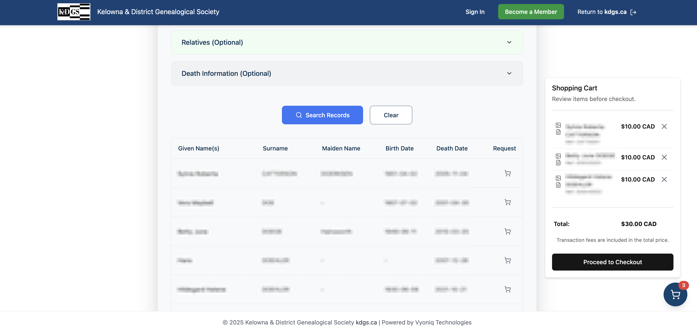
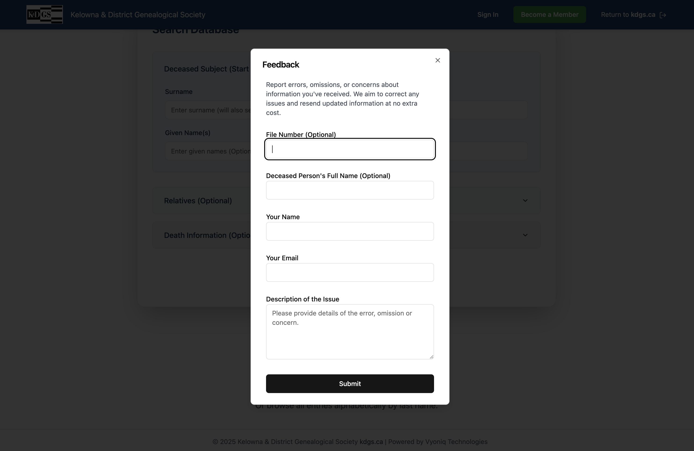

# KDGS Genealogy Platform

<div align="center">
  <strong>Complete Genealogy Management Solution for Kelowna and District Genealogical Society</strong>
</div>
<br />
<div align="center">
  
</div>
<br />
<div align="center">
  Built with Next.js 14 App Router • PostgreSQL • TypeScript
</div>
<br />

## 📋 Projects Overview

This repository contains two complementary applications that together provide a complete genealogy management solution:

### 🔐 [KDGS Admin Dashboard](#kdgs-admin-dashboard) - Internal Management System

A comprehensive admin interface for managing obituaries, genealogical resources, and image files. Features role-based access control, advanced search capabilities, and full CRUD operations for genealogical data.

**Access**: [Admin Dashboard](https://search.kdgs.ca/dashboard)

---

### 🌍 [Public Search Page](#public-search-page) - Member & Public Genealogy Portal

A public-facing search portal where KDGS members and the general public can search through the society's extensive obituary collection, purchase digital copies, and request genealogical research services.

**Access**: [Public Search Portal](<https://search.kdgs.ca)>)

---

## KDGS Admin Dashboard

### Overview

The KDGS Admin Dashboard is a sophisticated internal management system designed specifically for genealogical society operations. It provides secure, role-based access to comprehensive obituary management, image processing, and administrative functions.

### Tech Stack

- **Framework**: [Next.js 14](https://nextjs.org) (with App Router)
- **Language**: [TypeScript](https://www.typescriptlang.org)
- **Authentication**: [Clerk](https://clerk.com) (Role-based access control)
- **Database**: [PostgreSQL](https://www.postgresql.org) with [Prisma](https://www.prisma.io) as ORM
- **Styling**: [Tailwind CSS](https://tailwindcss.com)
- **UI Components**: [Shadcn UI](https://ui.shadcn.com/)
- **Forms**: [React Hook Form](https://react-hook-form.com) with [Zod](https://github.com/colinhacks/zod) for validation
- **API**: Next.js API Routes
- **Deployment**: [Vercel](https://vercel.com)
- **File Storage**: [MinIO](https://min.io/)
- **PDF Generation**: [pdf-lib](https://pdf-lib.js.org/)
- **Email Service**: [EmailJS](https://www.emailjs.com/)

### Key Features

#### 🔐 Security & Authentication

- **Clerk Authentication**: Robust user authentication with role-based access control
- **User Role Management**: Multiple roles (Viewer, Scanner, Indexer, Proofreader, Admin)
- **Protected Super Admin**: Special safeguards for the super admin account
- **Secure Password Generation**: Automated secure password creation for new users
- **Password Visibility Toggle**: Enhanced UX for password input fields

#### 📝 Obituary Management

- **Full CRUD Operations**: Create, read, update, and delete obituaries
- **Advanced Search & Filtering**: Comprehensive search capabilities across all fields
- **Duplicate Detection**: Automatic verification for similar existing obituaries
- **Reference Number Generation**: Automatic unique reference creation based on surnames
- **Relative Management**: Add, edit, and delete relatives associated with obituaries
- **Automatic Data Population**: Pre-filling of metadata fields (Entered By, Entered On)
- **Bulk Operations**: Efficient handling of multiple obituary records

#### 🖼️ Image Management System

- **MinIO Integration**: Secure cloud storage for image files
- **Bulk Image Upload**: Upload multiple images simultaneously
- **Image Rotation**: Rotate images directly within the dashboard
- **Rename Images**: Rename files with confirmation dialogs
- **Image Preview**: Quick preview before full view or download
- **Image Organization**: Efficient file management and organization
- **Case-Insensitive Search**: Improved search functionality for image records

#### 📊 Reporting & Analytics

- **PDF Generation**: Detailed PDF reports for obituaries using pdf-lib
- **File Number Display**: Prominent display of key identifiers
- **Consistent UI Design**: Matching design between web view and PDF output
- **Flexible Data Handling**: Graceful handling of missing or null data fields
- **Comprehensive Reporting**: Various report types for genealogical data

#### 👥 User Management

- **Admin Genealogists Management**: Complete CRUD for genealogist accounts
- **Email Notifications**: Automated welcome emails and password resets via EmailJS
- **Confirmation Dialogs**: Math challenges for sensitive operations (user deletion, password resets)
- **User Activity Tracking**: Monitoring and logging of user actions

#### 🎨 User Experience

- **Responsive Design**: Mobile-friendly interface with dark mode support
- **Server Actions**: Efficient Next.js server actions for data operations
- **Pagination**: Optimized loading for large datasets
- **Infinite Toast Duration**: Persistent notifications until user interaction
- **Modern UI**: Built with Shadcn UI components and Tailwind CSS

---

## Public Search Page

### Overview

The Public Search Page is a user-friendly portal designed for KDGS members and the general public to access the society's extensive obituary collection. It provides powerful search capabilities, e-commerce functionality for purchasing digital obituaries, and forms for requesting additional genealogical services.

**Access**: [Public Search Portal](<https://search.kdgs.ca>)

### Tech Stack

- **Framework**: [Next.js 14](https://nextjs.org) (with App Router)
- **Language**: [TypeScript](https://www.typescriptlang.org)
- **Authentication**: [Iron Session](https://github.com/vvo/iron-session) (Custom session management)
- **Database**: [PostgreSQL](https://www.postgresql.org) with [Prisma](https://www.prisma.io) as ORM
- **Styling**: [Tailwind CSS](https://tailwindcss.com)
- **UI Components**: [Shadcn UI](https://ui.shadcn.com/)
- **Forms**: [React Hook Form](https://react-hook-form.com) with [Zod](https://github.com/colinhacks/zod) for validation
- **Payment Processing**: [Stripe](https://stripe.com) (E-commerce integration)
- **API**: Next.js API Routes
- **Deployment**: [Vercel](https://vercel.com)
- **File Storage**: [MinIO](https://min.io/) (via shared admin system)

### Key Features

#### 🔍 Advanced Search System

- **Multi-Field Search**: Search by surname, given names, relatives, and death information
- **Death Date Filtering**: Exact date or date range search capabilities
- **Partial Match Support**: Flexible search with surname variations and nicknames
- **Alphabetical Browsing**: Browse all entries organized by last name
- **Search Tips & Guidance**: Built-in help system for effective searching
- **Responsive Search Interface**: Optimized for both desktop and mobile devices

#### 🛒 E-Commerce & Shopping Cart

- **Stripe Integration**: Secure payment processing for obituary purchases
- **Dynamic Pricing**: Real-time price fetching and display
- **Shopping Cart**: Persistent cart with item management
- **Member Discounts**: Free downloads for KDGS members
- **Payment Success Page**: Confirmation page with download links
- **Order Tracking**: Complete order management with reference numbers

#### 📄 Digital Content Delivery

- **PDF Reports**: Detailed obituary reports with genealogical information
- **Image Downloads**: High-quality digitized obituary images
- **Download Management**: Secure download links with expiration
- **File Organization**: Structured delivery of multiple file types
- **Order Confirmation**: Email notifications and order summaries

#### 📝 Service Request Forms

- **Feedback Form**: Submit questions, issues, or general feedback
- **New Obituary Request**: Request obituaries not yet in the collection
- **Volunteer Interest Form**: Express interest in volunteering with KDGS
- **Contact Management**: Streamlined communication with the society

#### 👤 User Experience

- **Public Access**: No registration required for basic search functionality
- **Member Portal**: Enhanced features for KDGS members
- **Responsive Design**: Mobile-optimized interface
- **Intuitive Navigation**: Clear user flow and navigation structure
- **Accessibility**: WCAG-compliant design and functionality

#### 🔒 Security & Privacy

- **Secure Sessions**: Iron session management for user state
- **Data Protection**: Secure handling of personal and payment information
- **GDPR Compliance**: Privacy-focused data handling practices
- **Secure Downloads**: Protected access to digital content

---

## Screenshots

### KDGS Admin Dashboard

#### 🔐 Authentication


_Modern two-column login page with branding, features overview, and secure authentication_

#### 📝 Obituary Management


_Obituaries management table with search, filtering, and pagination controls_


_Form for adding new obituaries with duplicate checking and reference generation_


_Detailed obituary editing interface with all fields and relatives management_

#### 🖼️ Image Management System


_Image files table with upload, search, and management capabilities_


_Bulk image upload interface with drag-and-drop functionality_


_Image editing tools including rotation and rename functionality_

#### 👥 User Management


_User management interface showing different roles and permissions_


_New user creation form with role assignment and security settings_

#### 📊 Reports and Analytics


_PDF report generation interface for obituaries with preview_

### Public Search Page

#### 🔍 Search Interface


_Public search page homepage with search tips and collection overview_


_Detailed search form with multiple filter options and date ranges_


_Alphabetical browsing interface for surname-based navigation_

#### 📋 Search Results


_Search results display with pagination and result details_


_Individual obituary result view with purchase options_

#### 🛒 E-Commerce Features


_Shopping cart showing selected obituaries and pricing_


_Secure payment processing interface with Stripe integration_

#### ✅ Purchase Success


_Payment confirmation page with download links and order details_


_File download interface for purchased obituaries and images_

#### 📝 Contact Forms


_User feedback and support request form_


_Form for requesting obituaries not in the current collection_


_Form for individuals interested in volunteering with KDGS_

---

## Getting Started

### Prerequisites

- Node.js 18+ and npm/yarn
- PostgreSQL database
- MinIO server for file storage
- Clerk account for authentication (Admin Dashboard)
- Stripe account for payments (Public Search)

### KDGS Admin Dashboard Setup

1. **Clone the repository**

   ```bash
   git clone https://github.com/your-username/kdgs-admin-dashboard.git
   cd kdgs-admin-dashboard
   ```

2. **Install dependencies**

   ```bash
   npm install
   ```

3. **Environment Setup**

   - Copy `.env.example` to `.env.local`
   - Configure Clerk authentication keys
   - Set up PostgreSQL database connection
   - Configure MinIO storage settings
   - Set up EmailJS for notifications

4. **Database Setup**

   ```bash
   npx prisma generate
   npx prisma db push
   ```

5. **Run the development server**

   ```bash
   npm run dev
   ```

6. **Access the application**
   - Open [http://localhost:3000](http://localhost:3000) for the admin dashboard

### Public Search Page Setup

The public search page is integrated within the same repository and shares the database with the admin dashboard.

1. **Access the public search**

   - Navigate to [http://localhost:3000/(public)/(search)](<http://localhost:3000/(public)/(search)>)

2. **Configuration**
   - Ensure Stripe keys are configured for payment processing
   - Set up Iron Session configuration for user sessions
   - Configure product pricing in Stripe dashboard

---

## Authentication

### Admin Dashboard

- Uses Clerk for authentication with role-based access control
- Supports multiple user roles with different permission levels
- Secure session management and user state handling

### Public Search Page

- Uses Iron Session for custom session management
- Optional user authentication for enhanced features
- Secure handling of payment and personal information

---

## File Storage

Both applications utilize MinIO for secure, scalable file storage:

- **Admin Dashboard**: Upload and manage obituary images and documents
- **Public Search Page**: Access to digitized obituary files for download
- **Shared Storage**: Both applications access the same MinIO bucket
- **Backup Solutions**: Automated backup procedures for data security

---

## Deployment

### Admin Dashboard

- Deployed on Vercel with automatic CI/CD
- Environment variables configured in Vercel dashboard
- Database hosted on PostgreSQL service
- MinIO storage configured for production

### Public Search Page

- Deployed alongside admin dashboard on same Vercel instance
- Shared database and file storage infrastructure
- Stripe webhooks configured for payment processing

---

## Contributing

We welcome contributions to both the Admin Dashboard and Public Search Page. Please follow these guidelines:

1. Fork the repository
2. Create a feature branch (`git checkout -b feature/amazing-feature`)
3. Commit your changes (`git commit -m 'Add amazing feature'`)
4. Push to the branch (`git push origin feature/amazing-feature`)
5. Open a Pull Request

Please ensure your code follows our established patterns and includes appropriate tests.

---

## License

This project is licensed under the GNU Affero General Public License v3.0 (AGPL-3.0). See the [LICENSE](LICENSE.md) file for details.

## Copyright and Attribution

© 2024-present Kelowna & District Genealogical Society | Powered by Vyoniq Technologies

The KDGS Genealogy Platform is open-source software developed and maintained by Vyoniq Technologies.

1. **Open Source License**: This software is licensed under the GNU Affero General Public License v3.0 (AGPL-3.0). You can find a copy of the license in the [LICENSE](LICENSE.md) file or at https://www.gnu.org/licenses/agpl-3.0.en.html

2. **Proprietary License**: For commercial use, a proprietary license is available. This license grants additional rights and support not provided under the AGPL-3.0.

This version of KDGS Genealogy Platform is the open-source version, freely available under the terms of the AGPL-3.0.

Users are free to view, use, modify, and distribute this software in accordance with the terms of the AGPL-3.0 license. However, any modifications must also be released under the AGPL-3.0 license.

For inquiries regarding commercial licensing or usage, please contact Javier Gongora (@javigong) on GitHub.
